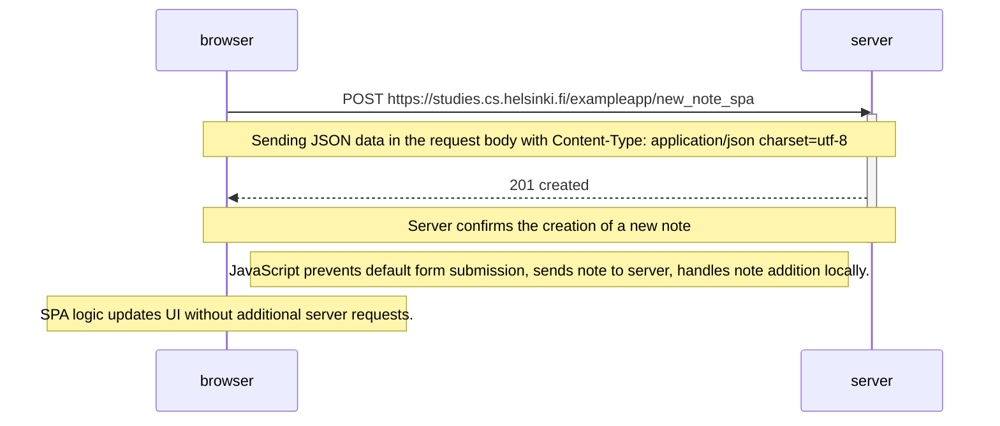

```mermaid
sequenceDiagram
    participant browser
    participant server

    browser->>server: POST https://studies.cs.helsinki.fi/exampleapp/new_note_spa
    activate server
    Note over browser,server: Sending JSON data in the request body with Content-Type: application/json charset=utf-8
    server-->>browser: 201 created
    Note over server,browser: Server confirms the creation of a new note
    deactivate server

    Note right of browser: JavaScript prevents default form submission, sends note to server, handles note addition locally.
    
    Note over browser:  SPA logic updates UI without additional server requests.

```
